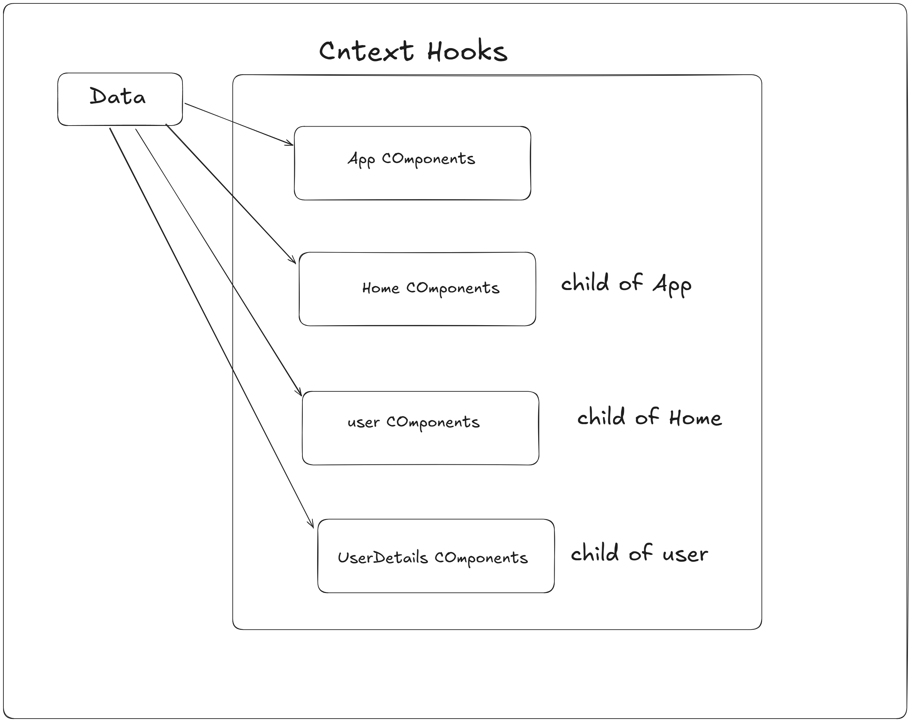

# React + Vite

This template provides a minimal setup to get React working in Vite with HMR and some ESLint rules.

Currently, two official plugins are available:

- [@vitejs/plugin-react](https://github.com/vitejs/vite-plugin-react/blob/main/packages/plugin-react/README.md) uses [Babel](https://babeljs.io/) for Fast Refresh
- [@vitejs/plugin-react-swc](https://github.com/vitejs/vite-plugin-react-swc) uses [SWC](https://swc.rs/) for Fast Refresh



## Using the useContext Hook in React

The `useContext` hook is a powerful feature in React that allows you to share state across multiple components without having to pass props down manually at every level.

### How to Use `useContext`

1. **Create a Context:**
    First, you need to create a context using `React.createContext()`. This will create a Context object.

    ```javascript
    import React, { createContext } from 'react';

    const MyContext = createContext();
    ```

2. **Provide the Context:**
    Use the `MyContext.Provider` component to wrap the part of your component tree that needs access to the context. The `value` prop of the provider will be available to all the components within the tree.

    ```javascript
    import React from 'react';
    import MyContext from './MyContext';

    const App = () => {
      const contextValue = { /* some value */ };

      return (
         <MyContext.Provider value={contextValue}>
            <MyComponent />
         </MyContext.Provider>
      );
    };
    ```

3. **Consume the Context:**
    Use the `useContext` hook to access the context value in any component within the provider tree.

    ```javascript
    import React, { useContext } from 'react';
    import MyContext from './MyContext';

    const MyComponent = () => {
      const contextValue = useContext(MyContext);

      return (
         <div>
            { /* use contextValue here */ }
         </div>
      );
    };
    ```

### Benefits of `useContext`

- **Simplifies State Management:** It helps in managing state across multiple components without prop drilling.
- **Improves Code Readability:** Makes the code cleaner and easier to understand by reducing the need for passing props through many levels.
- **Reusability:** Context can be reused across different parts of the application.

### Example

Here is a simple example demonstrating the use of `useContext`:

```javascript
import React, { createContext, useContext, useState } from 'react';

const ThemeContext = createContext();

const ThemeProvider = ({ children }) => {
  const [theme, setTheme] = useState('light');

  return (
     <ThemeContext.Provider value={{ theme, setTheme }}>
        {children}
     </ThemeContext.Provider>
  );
};

const ThemedComponent = () => {
  const { theme, setTheme } = useContext(ThemeContext);

  return (
     <div>
        <p>Current theme: {theme}</p>
        <button onClick={() => setTheme(theme === 'light' ? 'dark' : 'light')}>
          Toggle Theme
        </button>
     </div>
  );
};

const App = () => (
  <ThemeProvider>
     <ThemedComponent />
  </ThemeProvider>
);

export default App;
```

In this example, the `ThemeProvider` component provides the theme context to its children, and the `ThemedComponent` consumes the context to display and toggle the theme.
